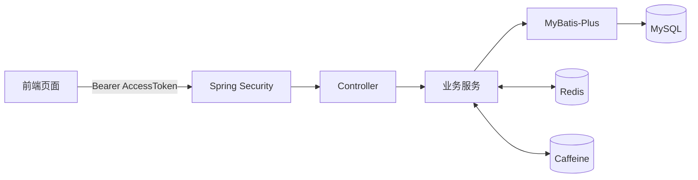

<div align="center">

# GameMatch 游戏队友匹配平台

面向游戏玩家的组队、匹配与社交平台，覆盖用户匹配、队伍推荐、热门排行、即时聊天和后台管理等完整业务流程。

[后端代码](backend/) · [前端代码](frontend/) · [数据库脚本](database/game_team_match_DB.sql) · [接口文档](docs/接口文档.md) · [Postman 集合](postman/gamematch.postman_collection.json)

</div>

## 项目亮点

- **双 Token 认证**：基于 Spring Security、JWT 和 Redis 实现 AccessToken/RefreshToken、无感刷新、主动退出及登录版本控制。
- **Redis 热门队伍排行榜**：使用 ZSet 保存队伍热度，采用 `ZINCRBY` 原子增量更新、Top N 查询和定时任务校准 MySQL 数据。
- **多级缓存治理**：队伍详情使用 Caffeine + Redis，结合随机 TTL、空值缓存、互斥锁、布隆过滤器和逻辑过期应对缓存穿透、击穿与雪崩。
- **队伍推荐**：按照用户游戏偏好，从 Redis 热门候选队伍中排除已满、已加入和本人创建的队伍，并按热度返回推荐结果。
- **MyBatis-Plus 改造**：使用 BaseMapper 处理通用 CRUD，复杂关联查询通过 Mapper XML 和自定义结果映射完成。
- **AOP 日志与耗时统计**：通过自定义注解统一记录关键业务操作和方法执行时间，降低日志代码对业务逻辑的侵入。
- **前后端认证联动**：前端统一封装请求层，自动携带 AccessToken，在 401 后刷新双 Token并重试原请求。

## 功能模块

| 模块 | 已实现功能 |
| --- | --- |
| 认证授权 | 注册、登录、双 Token 刷新、退出登录、管理员权限控制 |
| 用户中心 | 资料维护、公开资料、个性化用户匹配 |
| 队伍系统 | 发布、详情、申请、审批、退出、解散、成员管理 |
| 推荐排行 | 热门队伍 Top N、队伍排名、按游戏偏好推荐队伍 |
| 社交互动 | 好友申请、好友管理、私聊、队伍聊天、未读数 |
| 平台能力 | 文件上传、AI 对话、通知、管理员后台 |

## 技术栈

| 层次 | 技术 |
| --- | --- |
| 后端 | Java 17、Spring Boot 3、Spring Security、Spring AOP |
| 数据访问 | MyBatis-Plus、Mapper XML、MySQL 8 |
| 缓存 | Redis、Caffeine、Redis Bitmap 布隆过滤器 |
| 认证 | JWT、AccessToken + RefreshToken、Redis 登录版本 |
| 前端 | Express 4、原生 HTML/CSS/JavaScript、Fetch API |
| 工具 | Maven、Postman、Springdoc OpenAPI |

## 项目结构

项目采用 Monorepo 结构，默认 `main` 分支包含完整源码：

```text
git_test/
├── backend/          Spring Boot 后端
├── frontend/         Express 前端
├── database/         MySQL 初始化脚本
├── docs/             接口文档
├── postman/          Postman 集合与环境
└── README.md         项目总览
```

## 核心链路



登录成功后，后端签发短期 AccessToken 和长期 RefreshToken。业务请求由 Spring Security 校验 AccessToken 及 Redis 中的登录版本；AccessToken 过期时，前端使用 RefreshToken 换取新的双 Token并自动重试请求。

## 本地运行

### 1. 准备环境

- JDK 17
- MySQL 8
- Redis 6+
- Node.js 18+

执行 [`database/game_team_match_DB.sql`](database/game_team_match_DB.sql)，脚本会创建并初始化数据库 `game_team_match`。

### 2. 启动后端

```powershell
cd backend
$env:DB_PASSWORD="你的 MySQL 密码"
$env:JWT_SECRET="至少 32 位的随机字符串"
.\mvnw.cmd spring-boot:run
```

如需使用 AI 对话功能，额外配置 `DOUBAO_API_KEY` 和 `DOUBAO_ENDPOINT_ID`。完整变量见 [`backend/.env.example`](backend/.env.example)。

后端默认地址：`http://localhost:8081`

### 3. 启动前端

```powershell
cd frontend
npm install
npm start
```

浏览器访问：`http://localhost:3000/login.html`

## 接口与测试

- 接口说明：[docs/接口文档.md](docs/接口文档.md)
- Postman 集合：[postman/gamematch.postman_collection.json](postman/gamematch.postman_collection.json)
- Postman 环境：[postman/gamematch.postman_environment.json](postman/gamematch.postman_environment.json)
- Swagger UI：后端启动后访问 `http://localhost:8081/swagger-ui/index.html`

除注册、登录和 Token 刷新等白名单接口外，业务接口需要携带：

```http
Authorization: Bearer <accessToken>
```

## 配置安全

数据库密码、JWT 密钥和第三方 API Key 均通过环境变量注入，不提交真实凭据。用于公开展示或部署时，应使用独立密钥并定期轮换。

## 当前说明

项目定位为个人实战与简历展示项目，目前已覆盖认证授权、关系型数据库、缓存治理、排行榜、推荐、AOP 和前后端联调等常见后端工程场景。
